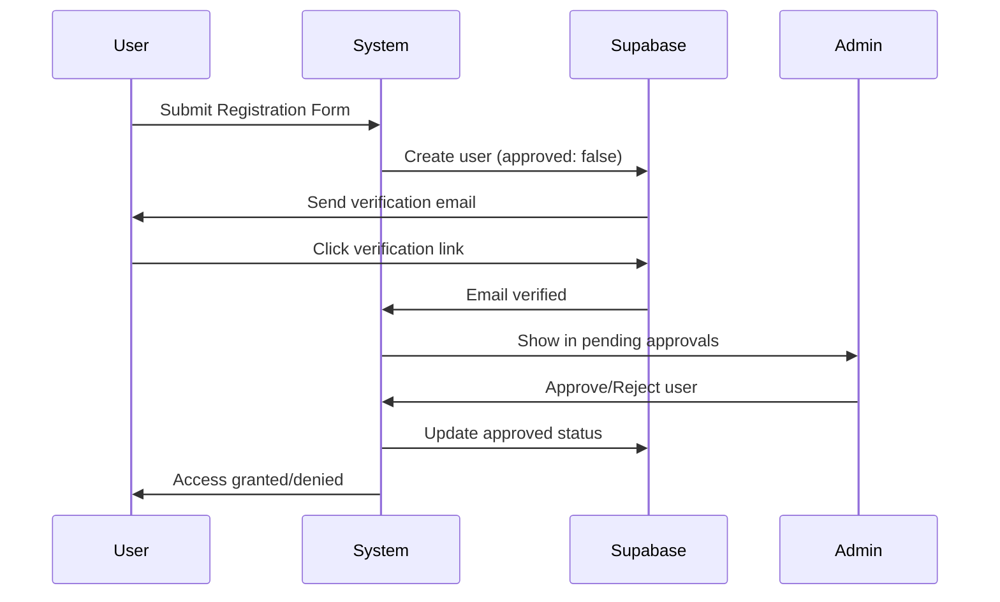

### **🔐 Core Tables**

| Table Group | Tables | Purpose |
|-------------|--------|---------|
| **User Management** | `profiles`, `departments`, `positions`, `user_supervisors` | User profiles and organizational hierarchy |
| **Roles & Permissions** | `roles`, `role_pages`, `user_roles` | Role-based access control (RBAC) |
| **Projects** | `projects`, `project_agencies`, `templates`, `project_team` | Project management and team assignments |
| **Proposals** | `proposal`, `expected_outputs`, `social_eco_impacts`, `literature_cited` | Research proposal management |
| **Workflow** | `document_signatory_templates`, `document_signatory_assignments`, `document_workflow`, `document_approvals` | Multi-step approval workflows |
| **E-Signatures** | `e_signatures` | Digital signature storage with certificates |
| **Budget** | `budget_categories`, `budget_line_items`, `fund_sources`, `ppmp_items` | Financial tracking and procurement |
| **Reporting** | `narrative_reports`, `narrative_output_accomp`, `accomplishments` | Progress and narrative reporting |
| **Notifications** | `notifications`, `document_history`, `document_drafts` | Alerts, audit trails, and auto-save |

### **📋 Key Features**

#### **Role-Based Access Control (RBAC)**
```sql
-- 7 predefined roles with hierarchical levels
INSERT INTO public.roles (title, description, level) VALUES
    ('user', 'Regular user who can create documents', 10),
    ('admin', 'System administrator', 100),
    ('supervisor', 'Reviews and approves documents', 20),
    ('chief_tss', 'Technical review', 30),
    ('budget_officer', 'Financial review', 40),
    ('rd', 'Regional Director - final approval', 50),
    ('viewer', 'Can only view documents', 5);
```

#### **Document Signatory Templates**
```sql
-- Define signatory flow per document type
INSERT INTO public.document_signatory_templates (document_type_id, step_order, signatory_label) VALUES
    (1, 1, 'Noted By'),       -- Step 1 for Proposals
    (1, 2, 'Checked By'),     -- Step 2 for Proposals
    (1, 3, 'Recommended By'), -- Step 3 for Proposals
    (1, 4, 'Approved By');    -- Step 4 for Proposals
```

#### **E-Signature Support**
```sql
-- Store digital signatures with audit trail
CREATE TABLE public.e_signatures (
    id SERIAL PRIMARY KEY,
    approval_id INTEGER REFERENCES public.document_approvals(id),
    signature_image TEXT NOT NULL,      -- Base64 encoded signature
    signature_hash VARCHAR(255),        -- Hash for integrity verification
    certificate_info JSONB,             -- Certificate details
    ip_address INET,                    -- Signer's IP
    user_agent TEXT,                    -- Browser/device info
    signed_at TIMESTAMP DEFAULT CURRENT_TIMESTAMP,
    consent_text TEXT,                  -- Legal consent message
    consent_version VARCHAR(20)
);
```

---

## 👥 **User Registration & Approval System**

The system implements a **secure two-factor registration process** with email verification and admin approval.

### **📝 Registration Flow**



### **🔧 Admin User Approval UI**

The admin dashboard includes a **User Management** section with tabs for:

| Tab | Description |
|-----|-------------|
| **Pending Approvals** | Users who have verified their email but await admin approval |
| **All Users** | Complete list of approved system users |

#### **Approval Features**
- ✅ **Approve**: Grant system access based on assigned role
- ❌ **Reject**: Delete account permanently
- 🔍 **Search & Filter**: Find pending users by name, email, or department
- 📱 **Responsive Design**: Works on desktop and mobile devices

### **📁 New Components**

```
src/
├── composables/
│   └── useUserApproval.ts     # User approval logic & state management
├── types/
│   └── database.ts            # TypeScript types for all database tables
└── pages/admin/components/
    ├── PendingUsersTable.vue  # Table displaying pending registrations
    └── dialogs/
        └── UserApprovalDialog.vue  # Confirm approve/reject actions
```

### **💻 Usage Example**

```typescript
// Using the useUserApproval composable
import { useUserApproval } from '@/composables/useUserApproval'

const { 
  pendingUsers,      // Reactive list of pending users
  pendingCount,      // Number of pending approvals
  loading,           // Loading state
  fetchPendingUsers, // Fetch all pending users
  approveUser,       // Approve a user by ID
  rejectUser,        // Reject and delete a user
} = useUserApproval()

// Fetch pending users
await fetchPendingUsers()

// Approve a user
await approveUser(userId)

// Reject a user (deletes account)
await rejectUser(userId)
```

### **🔒 Security Features**

- **Email Verification Required**: Users must verify email before admin review
- **Service Role Operations**: Admin actions use Supabase service role for elevated privileges
- **RLS Policies**: Row Level Security ensures data isolation
- **Audit Trail**: All approval actions are logged

---

## 🔄 **Document Workflow System**

The system supports **dynamic multi-step approval workflows** with e-signature capabilities.

### **📋 Supported Document Types**

| Type | Table | Signatory Steps |
|------|-------|-----------------|
| Proposal | `proposal` | Noted → Checked → Recommended → Approved |
| Narrative Report | `narrative_reports` | Reviewed → Approved |
| Budget | `budget_categories` | Prepared → Certified → Approved |
| Financial Report | `financial_reports` | Custom |
| PPMP | `ppmp_items` | Custom |

### **📊 Workflow States**

```typescript
type WorkflowStatus = 
  | 'draft'           // Document being created
  | 'submitted'       // Submitted for review
  | 'in_review'       // Under approval process
  | 'approved'        // Fully approved
  | 'rejected'        // Rejected at any step
  | 'revision_needed' // Requires changes
  | 'completed'       // Process complete
```

### **🔀 Approval Process**

1. **Document Created** → Status: `draft`
2. **User Assigns Signatories** → Select WHO for each signatory role
3. **User Submits** → Status: `submitted`
4. **Each Signatory Reviews** → Status: `in_review`
   - Signatory applies e-signature
   - If approved → Next step
   - If rejected → Status: `rejected` or `revision_needed`
5. **Final Approval** → Status: `approved` → `completed`

### **✍️ E-Signature Features**

- **Digital Signature Capture**: Canvas-based signature input
- **Hash Verification**: SHA-256 hash for integrity
- **Audit Trail**: IP address, user agent, timestamp
- **Certificate Support**: Optional PKI integration
- **Legal Consent**: Consent text and versioning

---

## 🚀 **Getting Started with New Schema**

### **1. Database Setup**

Run the SQL schema in your Supabase project:

```bash
# In Supabase SQL Editor, execute the schema file
# This creates all tables, indexes, RLS policies, triggers, and views
```

### **2. Environment Variables**

Ensure your `.env` file includes:

```env
VITE_SUPABASE_URL=your-supabase-url
VITE_SUPABASE_ANON_KEY=your-anon-key
VITE_SUPABASE_SERVICE_ROLE_KEY=your-service-role-key
```

> ⚠️ **Important**: The service role key should only be used server-side or in secure admin operations.

### **3. Initial Roles Setup**

The schema includes 7 predefined roles. Assign users to roles using the admin interface or directly in the database:

```sql
-- Assign admin role to a user
INSERT INTO public.user_roles (user_id, role_id, is_active)
VALUES ('user-uuid-here', 2, true);  -- 2 = admin role
```

### **4. Configure Signatory Templates**

The schema includes default signatory templates. Customize as needed:

```sql
-- Add custom signatory step
INSERT INTO public.document_signatory_templates 
  (document_type_id, step_order, signatory_label) 
VALUES 
  (1, 5, 'Final Review By');
```

---

## 📈 **API Reference**

### **User Approval Composable**

```typescript
interface UseUserApproval {
  // State
  pendingUsers: Ref<PendingUser[]>
  loading: Ref<boolean>
  error: Ref<string | null>
  pendingCount: ComputedRef<number>
  
  // Methods
  fetchPendingUsers(): Promise<{ users: PendingUser[] | null; error: Error | null }>
  approveUser(userId: string): Promise<{ success: boolean; error: Error | null }>
  rejectUser(userId: string): Promise<{ success: boolean; error: Error | null }>
  getUserDisplayName(user: PendingUser): string
  isProcessing(userId: string): boolean
}
```

### **PendingUser Type**

```typescript
interface PendingUser {
  id: string
  email: string | null
  created_at: string | null
  user_metadata: {
    full_name?: string
    prefix?: string
    suffix?: string
    department?: string
    position?: string
    role?: number
    approved?: boolean
  }
  email_confirmed_at: string | null
}
```

### **Database Views**

The schema includes helpful views for common queries:

| View | Purpose |
|------|---------|
| `vw_document_status` | Current status of all documents in workflow |
| `vw_signatory_queue` | Pending approvals for each signatory |
| `vw_document_signatories` | All signatories for a document with status |

```sql
-- Get all pending approvals for a user
SELECT * FROM vw_signatory_queue 
WHERE signatory_id = 'user-uuid'
ORDER BY days_pending DESC;

-- Get document status overview
SELECT * FROM vw_document_status 
WHERE current_status = 'in_review';
```

---
