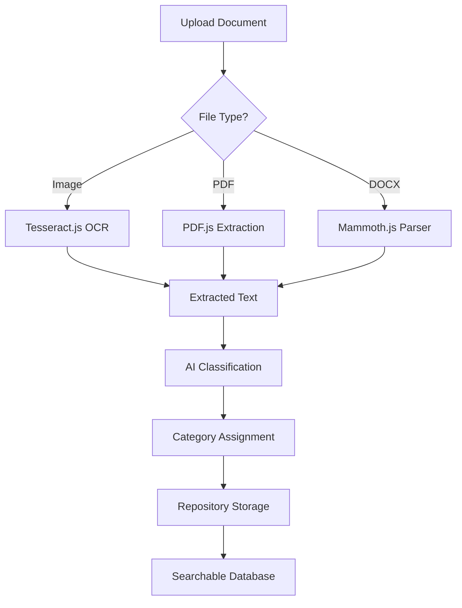
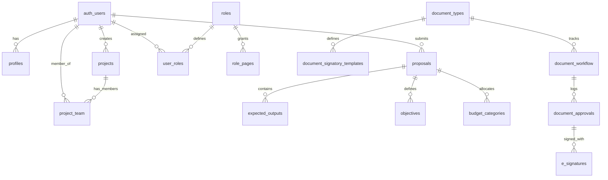
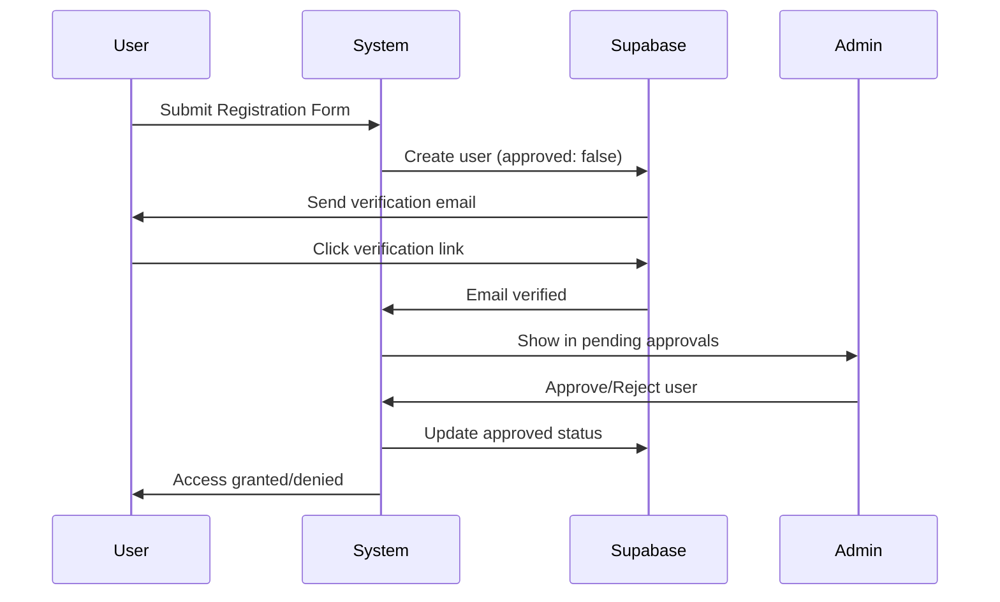

# 🚀 Web-Based Automated Document Classification System

<div align="center">


### 🎯 **AI-Powered OCR Document Classification for Accreditation Management**

*Automate document processing, classification, and repository management with intelligent OCR technology!*

[](https://codespaces.new/centmarde/thesis-template-web-reusable?quickstart=1)
[](https://vercel.com/new/clone?repository-url=https://github.com/centmarde/thesis-template-web-reusable)

</div>

---

## ✨ **What Makes This Special?**

This is an **intelligent, OCR-powered** document management system designed specifically for **accreditation project milestones**. The system automatically processes, classifies, and organizes accreditation documents into a centralized repository, eliminating manual sorting and ensuring compliance tracking.

### 🎨 **Key Innovation: OCR-Driven Document Processing**
```typescript
// Upload any document format
uploadDocument(file: File) {
  // 1. Extract text using Tesseract.js OCR
  const text = await processOCR(file)
  
  // 2. AI-powered classification
  const category = classifyDocument(text)
  
  // 3. Auto-organize in repository
  await saveToRepository(file, category, metadata)
}
```
↓ *Automatically becomes* ↓
```
📁 Accreditation Repository
  ├── 📂 Standard 1: Governance
  ├── 📂 Standard 2: Faculty
  ├── 📂 Standard 3: Curriculum
  └── 📂 Standard 4: Research
      └── ✅ Your Document (Auto-Classified)
```

---

## 🛠️ **Tech Stack & Architecture**

<table>
<tr>
<td width="50%">

### **Frontend Core**
- **🖼️ Vue 3** - Composition API with `<script setup>`
- **🎨 Vuetify 3** - Material Design components **(Styling-Only)**
- **📘 TypeScript** - Full type safety with strict config
- **⚡ Vite** - Lightning-fast dev server & builds
- **🍍 Pinia** - Intuitive state management
- **🔍 Tesseract.js** - Advanced OCR text extraction

</td>
<td width="50%">

### **Backend & Services**
- **🚀 Supabase** - Authentication & Database
- **🌐 Axios** - HTTP client for data fetching
- **🔄 Vue Router 4** - File-based auto-routing
- **🎭 Vue Toastification** - Elegant notifications
- **📋 Auto-imports** - Zero-import development
- **📄 PDF.js** - PDF text extraction
- **📝 Mammoth.js** - DOCX document processing

</td>
</tr>
</table>

### **🤖 Zero-Config Automation**
| Plugin | Purpose | Auto-Generated |
|--------|---------|----------------|
| `unplugin-vue-router` | 📁 **File-based routing** | Routes from `src/pages/*.vue` |
| `unplugin-vue-components` | 🔧 **Auto-importing** | Global components from `src/components/` |
| `vite-plugin-vue-layouts-next` | 📐 **Layout system** | Layout wrappers from `src/layouts/` |
| `unplugin-auto-import` | ⚡ **Composables** | Vue/Pinia/Router APIs without imports |
| `unplugin-fonts` | 🔤 **Typography** | Google Fonts auto-loading |

---

## 🏗️ **OCR-Powered Document Processing Architecture**

### **Document Processing Pipeline**


### **OCR Composable Pattern**
```typescript
// src/composables/fileSubmit.ts
export function useFileSubmit() {
  const selectedFile = ref<File | null>(null)
  const ocrResult = ref('')
  const fileType = ref<FileType>(null)
  
  const processOCR = async (file: File) => {
    const worker = await createWorker('eng')
    const { data } = await worker.recognize(file)
    ocrResult.value = data.text
    await worker.terminate()
  }
  
  const processPDF = async (file: File) => {
    const pdf = await pdfjsLib.getDocument({ data: arrayBuffer }).promise
    // Extract text from all pages
  }
  
  return { selectedFile, ocrResult, processOCR, processPDF }
}
```

---

## 🚀 **Quick Start**

### **Prerequisites**
- Node.js 18+ 
- npm/yarn/pnpm

### **Installation**
```bash
# Clone the repository
git clone https://github.com/centmarde/thesis-template-web-reusable.git
cd thesis-template-web-reusable

# Install dependencies
npm install

# Start development server
npm run dev
```

### **Using the OCR System**
1. **� Upload Documents**: Drag & drop or select images, PDFs, or DOCX files
2. **🔍 Automatic Processing**: OCR extracts text from all document types
3. **� View Results**: Extracted text appears in real-time
4. **💾 Save to Repository**: Classify and store documents automatically
5. **🔎 Search & Retrieve**: Find documents by content, category, or metadata

---

## 📁 **Project Structure**

```
src/
├── 📱 components/
│   ├── FIleSubmit.vue  # 🔍 OCR document processor component
│   ├── auth/           # Authentication components
│   ├── common/         # Shared UI components
│   └── [feature]/      # Feature-specific components
├── 🎛️ controller/      # Data fetching & state management
├── 🔧 composables/
│   └── fileSubmit.ts   # 📄 OCR processing logic
├── 📄 pages/           # Auto-routed page components
├── 🗃️ stores/          # Pinia state stores
├── 🎨 layouts/         # Layout wrapper components
├── � plugins/         # Vue plugin configurations
└── 📚 lib/             # Utility libraries & services
    ├── supabase.ts     # Database integration
    └── validator.ts    # Input validation

public/
└── 📊 data/
    └── external-page.json  # 🎯 Accreditation system configuration
```

---

## 💡 **Core Philosophy**

### **🎯 Intelligent Automation**
- **OCR-Powered**: Automatic text extraction from any document
- **AI Classification**: Smart categorization of accreditation materials
- **Zero Manual Filing**: Documents auto-organize by content and type
- **Compliance Ready**: Track and verify accreditation requirements

### **📄 Multi-Format Support**
- **Images**: JPG, PNG, BMP via Tesseract.js OCR
- **PDFs**: Text extraction with PDF.js
- **DOCX**: Document parsing with Mammoth.js
- **Real-Time Processing**: Instant text extraction and preview

### **🎨 User-Centric Design**
- **Drag & Drop**: Intuitive file upload interface
- **Live Preview**: See extracted text immediately
- **Copy to Clipboard**: Easy text transfer
- **Progress Tracking**: Visual feedback during processing

### **🔄 MCP-Enhanced Development**
- **Vuetify MCP**: Component API documentation
- **Context7**: External library references  
- **Sequential Thinking**: Complex problem solving
- **Playwright**: Automated UI testing

---

## 🤝 **Contributing & Recommendations**

We welcome contributions and recommendations! This project is designed to:

- **� Automate document processing** with advanced OCR technology
- **📊 Streamline accreditation** through intelligent classification
- **📱 Support cross-platform** deployment (Web, PWA, Mobile)
- **🔧 Simplify compliance** with automated tracking and reporting
- **📈 Scale efficiently** with modern Vue 3 patterns

### **Contribution Areas**
- 🤖 **AI Models**: Enhanced classification algorithms
- 🔍 **OCR Engine**: Multi-language support and accuracy improvements
- 📊 **Data Analytics**: Reporting and compliance dashboards
- 🔌 **Integrations**: Connect with accreditation bodies' APIs
- 📱 **Platform Support**: Mobile apps for on-the-go document scanning
- 📚 **Documentation**: Best practices for accreditation documentation

---

## 📄 **License**

This project is open source and available under the [MIT License](LICENSE).

---

<div align="center">

**🌟 Star this repo if it helps accelerate your development workflow!**

[🐛 Report Bug](https://github.com/centmarde/thesis-template-web-reusable/issues) • [💡 Request Feature](https://github.com/centmarde/thesis-template-web-reusable/issues) • [💬 Discussions](https://github.com/centmarde/thesis-template-web-reusable/discussions)

</div>

---

## 🗃️ **Database Schema (March 2026 Update)**

The system now includes a comprehensive database schema designed for **document workflow management**, **e-signatures**, **role-based access control**, and **multi-step approval processes**.

### **📊 Schema Overview**



### **🔐 Core Tables**

| Table Group | Tables | Purpose |
|-------------|--------|---------|
| **User Management** | `profiles`, `departments`, `positions`, `user_supervisors` | User profiles and organizational hierarchy |
| **Roles & Permissions** | `roles`, `role_pages`, `user_roles` | Role-based access control (RBAC) |
| **Projects** | `projects`, `project_agencies`, `templates`, `project_team` | Project management and team assignments |
| **Proposals** | `proposal`, `expected_outputs`, `social_eco_impacts`, `literature_cited` | Research proposal management |
| **Workflow** | `document_signatory_templates`, `document_signatory_assignments`, `document_workflow`, `document_approvals` | Multi-step approval workflows |
| **E-Signatures** | `e_signatures` | Digital signature storage with certificates |
| **Budget** | `budget_categories`, `budget_line_items`, `fund_sources`, `ppmp_items` | Financial tracking and procurement |
| **Reporting** | `narrative_reports`, `narrative_output_accomp`, `accomplishments` | Progress and narrative reporting |
| **Notifications** | `notifications`, `document_history`, `document_drafts` | Alerts, audit trails, and auto-save |

### **📋 Key Features**

#### **Role-Based Access Control (RBAC)**
```sql
-- 7 predefined roles with hierarchical levels
INSERT INTO public.roles (title, description, level) VALUES
    ('user', 'Regular user who can create documents', 10),
    ('admin', 'System administrator', 100),
    ('supervisor', 'Reviews and approves documents', 20),
    ('chief_tss', 'Technical review', 30),
    ('budget_officer', 'Financial review', 40),
    ('rd', 'Regional Director - final approval', 50),
    ('viewer', 'Can only view documents', 5);
```

#### **Document Signatory Templates**
```sql
-- Define signatory flow per document type
INSERT INTO public.document_signatory_templates (document_type_id, step_order, signatory_label) VALUES
    (1, 1, 'Noted By'),       -- Step 1 for Proposals
    (1, 2, 'Checked By'),     -- Step 2 for Proposals
    (1, 3, 'Recommended By'), -- Step 3 for Proposals
    (1, 4, 'Approved By');    -- Step 4 for Proposals
```

#### **E-Signature Support**
```sql
-- Store digital signatures with audit trail
CREATE TABLE public.e_signatures (
    id SERIAL PRIMARY KEY,
    approval_id INTEGER REFERENCES public.document_approvals(id),
    signature_image TEXT NOT NULL,      -- Base64 encoded signature
    signature_hash VARCHAR(255),        -- Hash for integrity verification
    certificate_info JSONB,             -- Certificate details
    ip_address INET,                    -- Signer's IP
    user_agent TEXT,                    -- Browser/device info
    signed_at TIMESTAMP DEFAULT CURRENT_TIMESTAMP,
    consent_text TEXT,                  -- Legal consent message
    consent_version VARCHAR(20)
);
```

---

## 👥 **User Registration & Approval System**

The system implements a **secure two-factor registration process** with email verification and admin approval.

### **📝 Registration Flow**



### **🔧 Admin User Approval UI**

The admin dashboard includes a **User Management** section with tabs for:

| Tab | Description |
|-----|-------------|
| **Pending Approvals** | Users who have verified their email but await admin approval |
| **All Users** | Complete list of approved system users |

#### **Approval Features**
- ✅ **Approve**: Grant system access based on assigned role
- ❌ **Reject**: Delete account permanently
- 🔍 **Search & Filter**: Find pending users by name, email, or department
- 📱 **Responsive Design**: Works on desktop and mobile devices

### **📁 New Components**

```
src/
├── composables/
│   └── useUserApproval.ts     # User approval logic & state management
├── types/
│   └── database.ts            # TypeScript types for all database tables
└── pages/admin/components/
    ├── PendingUsersTable.vue  # Table displaying pending registrations
    └── dialogs/
        └── UserApprovalDialog.vue  # Confirm approve/reject actions
```

### **💻 Usage Example**

```typescript
// Using the useUserApproval composable
import { useUserApproval } from '@/composables/useUserApproval'

const { 
  pendingUsers,      // Reactive list of pending users
  pendingCount,      // Number of pending approvals
  loading,           // Loading state
  fetchPendingUsers, // Fetch all pending users
  approveUser,       // Approve a user by ID
  rejectUser,        // Reject and delete a user
} = useUserApproval()

// Fetch pending users
await fetchPendingUsers()

// Approve a user
await approveUser(userId)

// Reject a user (deletes account)
await rejectUser(userId)
```

### **🔒 Security Features**

- **Email Verification Required**: Users must verify email before admin review
- **Service Role Operations**: Admin actions use Supabase service role for elevated privileges
- **RLS Policies**: Row Level Security ensures data isolation
- **Audit Trail**: All approval actions are logged

---

## 🔄 **Document Workflow System**

The system supports **dynamic multi-step approval workflows** with e-signature capabilities.

### **📋 Supported Document Types**

| Type | Table | Signatory Steps |
|------|-------|-----------------|
| Proposal | `proposal` | Noted → Checked → Recommended → Approved |
| Narrative Report | `narrative_reports` | Reviewed → Approved |
| Budget | `budget_categories` | Prepared → Certified → Approved |
| Financial Report | `financial_reports` | Custom |
| PPMP | `ppmp_items` | Custom |

### **📊 Workflow States**

```typescript
type WorkflowStatus = 
  | 'draft'           // Document being created
  | 'submitted'       // Submitted for review
  | 'in_review'       // Under approval process
  | 'approved'        // Fully approved
  | 'rejected'        // Rejected at any step
  | 'revision_needed' // Requires changes
  | 'completed'       // Process complete
```

### **🔀 Approval Process**

1. **Document Created** → Status: `draft`
2. **User Assigns Signatories** → Select WHO for each signatory role
3. **User Submits** → Status: `submitted`
4. **Each Signatory Reviews** → Status: `in_review`
   - Signatory applies e-signature
   - If approved → Next step
   - If rejected → Status: `rejected` or `revision_needed`
5. **Final Approval** → Status: `approved` → `completed`

### **✍️ E-Signature Features**

- **Digital Signature Capture**: Canvas-based signature input
- **Hash Verification**: SHA-256 hash for integrity
- **Audit Trail**: IP address, user agent, timestamp
- **Certificate Support**: Optional PKI integration
- **Legal Consent**: Consent text and versioning

---

## 🚀 **Getting Started with New Schema**

### **1. Database Setup**

Run the SQL schema in your Supabase project:

```bash
# In Supabase SQL Editor, execute the schema file
# This creates all tables, indexes, RLS policies, triggers, and views
```

### **2. Environment Variables**

Ensure your `.env` file includes:

```env
VITE_SUPABASE_URL=your-supabase-url
VITE_SUPABASE_ANON_KEY=your-anon-key
VITE_SUPABASE_SERVICE_ROLE_KEY=your-service-role-key
```

> ⚠️ **Important**: The service role key should only be used server-side or in secure admin operations.

### **3. Initial Roles Setup**

The schema includes 7 predefined roles. Assign users to roles using the admin interface or directly in the database:

```sql
-- Assign admin role to a user
INSERT INTO public.user_roles (user_id, role_id, is_active)
VALUES ('user-uuid-here', 2, true);  -- 2 = admin role
```

### **4. Configure Signatory Templates**

The schema includes default signatory templates. Customize as needed:

```sql
-- Add custom signatory step
INSERT INTO public.document_signatory_templates 
  (document_type_id, step_order, signatory_label) 
VALUES 
  (1, 5, 'Final Review By');
```

---

## 📈 **API Reference**

### **User Approval Composable**

```typescript
interface UseUserApproval {
  // State
  pendingUsers: Ref<PendingUser[]>
  loading: Ref<boolean>
  error: Ref<string | null>
  pendingCount: ComputedRef<number>
  
  // Methods
  fetchPendingUsers(): Promise<{ users: PendingUser[] | null; error: Error | null }>
  approveUser(userId: string): Promise<{ success: boolean; error: Error | null }>
  rejectUser(userId: string): Promise<{ success: boolean; error: Error | null }>
  getUserDisplayName(user: PendingUser): string
  isProcessing(userId: string): boolean
}
```

### **PendingUser Type**

```typescript
interface PendingUser {
  id: string
  email: string | null
  created_at: string | null
  user_metadata: {
    full_name?: string
    prefix?: string
    suffix?: string
    department?: string
    position?: string
    role?: number
    approved?: boolean
  }
  email_confirmed_at: string | null
}
```

### **Database Views**

The schema includes helpful views for common queries:

| View | Purpose |
|------|---------|
| `vw_document_status` | Current status of all documents in workflow |
| `vw_signatory_queue` | Pending approvals for each signatory |
| `vw_document_signatories` | All signatories for a document with status |

```sql
-- Get all pending approvals for a user
SELECT * FROM vw_signatory_queue 
WHERE signatory_id = 'user-uuid'
ORDER BY days_pending DESC;

-- Get document status overview
SELECT * FROM vw_document_status 
WHERE current_status = 'in_review';
```

---