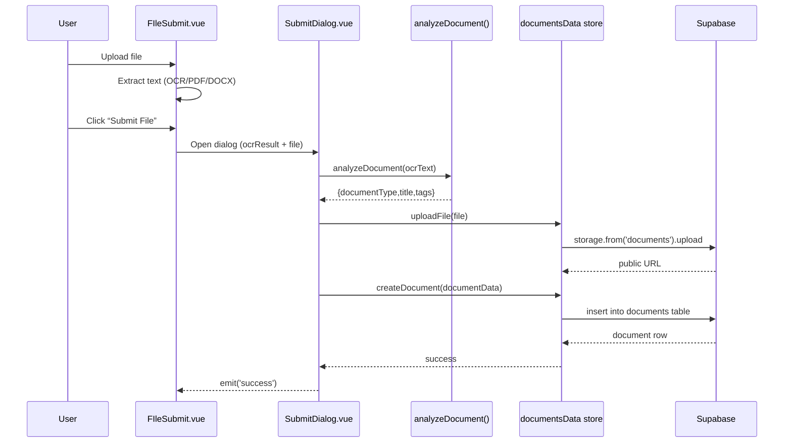

# Project Overview (Study Notes)

This document explains how the project is wired together: which folders own what, how the TypeScript modules connect, and the main runtime flows.

## What this app is

A Vue 3 + Vuetify + TypeScript web app that:

- Authenticates users via Supabase Auth.
- Lets authenticated users upload files (image/PDF/DOCX), extract text (OCR/text extraction), then submit a “document” record.
- Stores document metadata + versions in a Supabase table (`documents`) and files in a Supabase Storage bucket (`documents`).
- Provides:
  - A “Repository” view for browsing documents.
  - Admin screens for document approvals and user/role management.

## Tech stack snapshot

- Build/dev: Vite (see vite.config.mts)
- UI: Vuetify 3
- State: Pinia
- Routing: Vue Router
- Auth/DB/Storage: Supabase (`@supabase/supabase-js`)
- OCR/Text extraction:
  - Images: `tesseract.js`
  - PDFs: `pdfjs-dist`
  - DOCX: `mammoth`
- “LLM classification”: Groq SDK calling `llama-3.1-8b-instant` (see src/utils/fetchLLM.ts)

## High-level runtime flow

```mermaid
flowchart TD
  A[index.html] --> B[src/main.ts]
  B --> C[createApp(App)]
  C --> D[src/plugins/registerPlugins]
  D --> E[Vuetify plugin]
  D --> F[Router plugin]
  D --> G[Pinia plugin]
  D --> H[Toastification plugin]
  C --> I[src/App.vue]
  I --> J[<router-view/>]
```

Key files:

- src/main.ts: bootstraps the Vue app.
- src/plugins/index.ts: installs Vuetify + Router + Pinia, then configures toast.
- src/App.vue: simple wrapper that renders the active route.

## Folder map (what each directory is for)

### src/pages (route-level screens)

These are “page components” (views). In this codebase, routes are defined manually in src/router/router.ts and point to these pages.

Notable pages:

- src/pages/index.vue: landing/hero page (uses OuterLayoutWrapper).
- src/pages/Auth.vue: login/register container.
- src/pages/HomeView.vue: “dashboard” area (currently hosts the OCR file submit feature).
- src/pages/account/RepositoryView.vue: repository browsing + history/new versions + delete.
- src/pages/admin/DocumentApprovalView.vue: approval/rejection for document versions.
- src/pages/admin/UserManagementView.vue: wraps the UserManagementTable.
- src/pages/admin/AdminUserRolesView.vue: role CRUD + permission mapping to routes.

### src/components (reusable UI blocks)

- src/components/FIleSubmit.vue: the upload/preview + “submit” UI.
- src/components/dialogs/SubmitDialog.vue: analyzes extracted text (LLM) and writes a new document row.
- src/components/dialogs/HistoryDialog.vue: shows version history (used from RepositoryView).
- src/components/common/*: navbars, footers, sidebar, small shared widgets.

### src/composables (logic you reuse across components)

- src/composables/fileSubmit.ts: the file pipeline logic (image OCR, PDF text extraction, DOCX text extraction). Returns reactive state + handlers.
- src/composables/useTheme.ts: dynamic theme initialization and toggling.

### src/controller (page configuration fetchers)

Controllers fetch configuration from `public/data/external-page.json` and expose it as reactive state.

- src/controller/landingController.ts: loads landing page content + triggers theme initialization.
- src/controller/authPageController.ts: loads Auth page-specific config (quote, background, layout prefs).

### src/stores (Pinia state + data access)

This project uses “store-as-service”: stores both hold state AND perform Supabase calls.

- src/stores/authUser.ts:
  - Login/register/logout
  - Get current user
  - Admin: list users (via a service-role client)
- src/stores/documentsData.ts:
  - CRUD for `documents`
  - Upload/delete files in Supabase Storage
  - Versioning model
  - Admin approval workflows
- src/stores/roles.ts: CRUD for `roles` table.
- src/stores/pages.ts: CRUD for `role_pages` table (routes allowed per role).

### src/router (navigation + security)

- src/router/router.ts: route table (paths → page components). Protected routes use `meta.requiresAuth`.
- src/router/guards.ts: auth guard + role-based page access.
- src/router/index.ts: creates router instance and installs guards.

### src/lib (low-level utilities)

- src/lib/supabase.ts: creates Supabase clients and exports helper logout.
- src/lib/validator.ts: field validation utilities (used by auth forms).

### src/themes + src/styles

- src/themes/base.ts + src/themes/index.ts: build Vuetify theme objects from external-page.json.
- src/plugins/vuetify.ts: creates Vuetify instance with placeholder themes, then runtime replaces them.
- src/styles/settings.scss: Vuetify SASS configuration.

### public/data/external-page.json (dynamic “site config”)

This JSON is used as a runtime configuration source for:

- Landing page text and features.
- Theme primary/secondary colors.
- Which navbar/footer variants to display.
- Auth page quote/background settings.

## Routing, guards, and role-based access

### Route table

Routes are defined in src/router/router.ts, including:

- Public:
  - `/` → landing
  - `/auth` → auth screen
- Auth-required:
  - `/account/home`
  - `/account/repository`
  - `/admin/*`

### Guard behavior

src/router/guards.ts implements:

1) Authentication check
- If `to.meta.requiresAuth` and there is no `access_token` in `localStorage`, redirect to `/auth`.

2) Public-page redirect
- If a user is logged in and navigates to `/` or `/auth`, redirect to `/account/home`.

3) Role-page access check (for protected routes other than `/account/home`)
- Reads the current Supabase user.
- Reads the role id from `user.user_metadata.role`.
- Queries `role_pages` for that role.
- Allows navigation only if the current path is included.
- Otherwise redirects to `/forbidden`.

Important note:
- The sidebar UI currently does not filter links by role; instead, the guard enforces access when navigating.

## Data model (Supabase tables/buckets used by code)

Based on store queries:

### `roles` table
- id, created_at, title

Used by:
- src/stores/roles.ts
- Admin role UI (src/pages/admin/AdminUserRolesView.vue)

### `role_pages` table
- id, created_at, role_id, pages

Meaning:
- One row = one allowed route (path string) for a role.

Used by:
- src/stores/pages.ts
- Router guard (src/router/guards.ts)

### `documents` table
Fields used in code include:

- id, created_at
- user_id (owner)
- status (`pending`/`approved`/`rejected`)
- title, contents
- tags (stored as object)
- attach_file (public URL)
- current_version (number)
- version (stored as an array-like JSON value)
- last_opened_at/by/name, last_downloaded_at/by/name

Used by:
- src/stores/documentsData.ts

### Storage bucket `documents`

Used by:
- src/stores/documentsData.ts → uploadFile/deleteFile

## Feature walkthroughs

### A) OCR / Text extraction pipeline

Code: src/composables/fileSubmit.ts

- User selects/drops a file.
- Detect file type by MIME:
  - image/* → Tesseract OCR
  - application/pdf → PDF.js getTextContent
  - DOCX → mammoth.extractRawText
- The extracted text ends up in `ocrResult`.

### B) “Submit document” flow (LLM + Supabase write)



Where it lives:

- src/components/FIleSubmit.vue: UI + opens SubmitDialog.
- src/components/dialogs/SubmitDialog.vue:
  - Calls src/utils/fetchLLM.ts (Groq SDK) to classify.
  - Uploads file to storage.
  - Inserts a document row that includes an initial version entry `v: 1`.
- src/stores/documentsData.ts: actual Supabase calls.

### C) Repository browsing + versioning

Page: src/pages/account/RepositoryView.vue

- On mount, calls `docsStore.fetchRepositoryData()` which:
  - loads all documents
  - loads current user documents
- Supports:
  - View mode: “Mine” vs “All”
  - Search
  - Tag selection (required for “All” view)
  - History dialog (version list)
  - New version submission (adds a new version and marks document pending)
  - Delete (owner only)
  - Access logging (open/download updates last_* fields)

Versioning logic lives in src/stores/documentsData.ts:

- `createNewDocumentVersion()` appends a new version entry and sets status to `pending`.
- Admin approval acts at the version level (`approveVersion`/`rejectVersion`).

### D) Admin: document approvals

Page: src/pages/admin/DocumentApprovalView.vue

- Calls `docsStore.fetchAdminVersionItems(filter)`.
- This flattens document rows into per-version items and filters by version.status.
- Buttons call:
  - `docsStore.approveVersion(documentId, v)`
  - `docsStore.rejectVersion(documentId, v)`

### E) Admin: roles and permissions

- Permissions are represented as ROUTE PATHS stored in `role_pages.pages`.
- src/utils/navigation.ts defines the available navigation items and optional “permission keys”.

Role editing flow:

- src/pages/admin/composables/adminUserRoles.ts
  - Creates/updates roles (roles table)
  - Deletes + recreates role_pages rows to match selected permissions/routes
- src/pages/admin/composables/roleEditFetchDialog.ts
  - Reads current role_pages for a role and maps them back into selectable permissions

## “Where do I start reading?” (recommended order)

1) App boot:
- src/main.ts
- src/plugins/index.ts
- src/App.vue

2) Routing + guards:
- src/router/router.ts
- src/router/guards.ts

3) Supabase wiring:
- src/lib/supabase.ts
- src/stores/authUser.ts

4) Main feature:
- src/components/FIleSubmit.vue
- src/composables/fileSubmit.ts
- src/components/dialogs/SubmitDialog.vue
- src/stores/documentsData.ts

5) Repository + admin:
- src/pages/account/RepositoryView.vue
- src/pages/admin/DocumentApprovalView.vue
- src/pages/admin/AdminUserRolesView.vue

## Notes for when you restructure later

If your goal is to “recreate/restructure completely”, a safe approach is to reorganize around boundaries:

- `src/features/ocr/*` (FIleSubmit + fileSubmit composable)
- `src/features/documents/*` (repository pages + documentsData store)
- `src/features/admin/*` (admin pages + admin composables)
- `src/core/*` (router, plugins, theme, supabase client)

Keep these contracts stable first:

- Supabase table/bucket names (`documents`, `roles`, `role_pages`, storage bucket `documents`).
- Router paths (because `role_pages.pages` stores literal paths).

## Security footnote (important if you deploy)

src/lib/supabase.ts initializes a “service role” client (`VITE_SUPABASE_SERVICE_ROLE_KEY`) in the browser for admin user management.

In production, a service-role key should NOT be shipped to the client. A safer design is:

- Move admin user management actions to a server/API (edge function, serverless function, or backend), and call that from the frontend.
